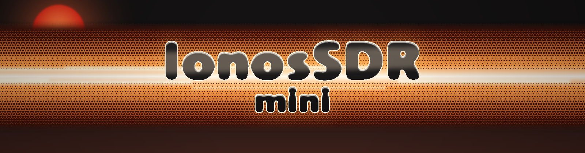
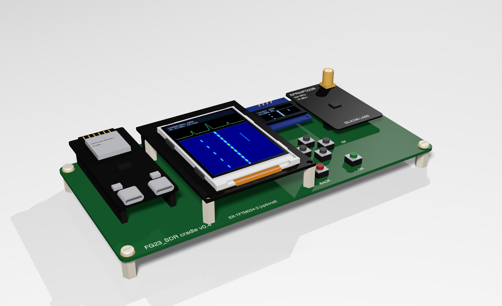
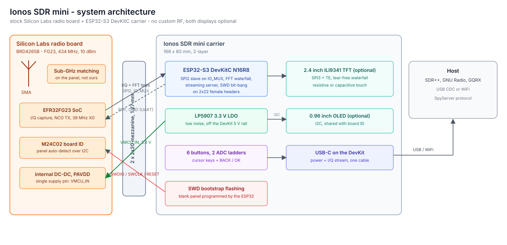

# Ionos SDR mini



Simplified, low-cost sibling of [Ionos SDR](https://github.com/ionos-sdr/ionos-sdr): a carrier PCB that turns a stock Silicon Labs radio board into a usable SDR. An ESP32-S3 DevKitC sits on female headers on the left, a Silicon Labs radio board plugs into the mezzanine socket on the right, and both displays are optional. No custom RF design, no exotic parts — the radio board you already have in a drawer does the RF.



*Design study of the v0.4 layout: DevKitC on headers, optional ER-TFTM024-3 TFT, optional SSD1306 OLED, cursor keys with BACK/OK, and the EFR32FG23 radio board (BRD4265B) on the right.*

**Status: hardware design in progress.** The firmware and the measured facts live in the [main repository](https://github.com/ionos-sdr/ionos-sdr); this repo holds the carrier board and its documentation.

## What it is

- **Carrier only.** 168 x 80 mm, 2-layer, four M3 nylon standoffs. No RF layout risk: matching network, SMA and shielding stay on the Silicon Labs radio board.
- **Any radio board fits.** The mezzanine pair is the standard WSTK radio board interface, so BRD4265B (FG23, 434 MHz, 10 dBm) is only the first panel. The pin-to-signal mapping differs per panel and is selected in firmware.
- **Panel auto-detect.** The radio board's M24C02 board-ID EEPROM sits on the same I2C bus as the OLED, so the firmware can read which panel is plugged in and load the matching pin map at boot.
- **Bootstrap flashing.** SWDIO, SWCLK, SWO and RESET are routed to the ESP32, which bit-bangs SWD. A blank radio board can be programmed with nothing but this board and a USB cable; routine updates then go over the UART command link.
- **One cable.** Power and data over the DevKit's USB-C. The radio gets its own low-noise LDO from the 5 V rail, not the DevKit's shared 3.3 V.

## Architecture



- **RX**: FG23 I/Q capture and server-side FFT lines over SPI2 (IO_MUX) to the ESP32-S3, then to the host or to the on-board display.
- **Control**: RDY handshake and a UART command link; SWD is bit-banged by the ESP32 so a blank panel can be programmed with nothing but this board.
- **Power**: a single low-noise LDO feeds VMCU_IN; the radio board's own DC-DC handles PAVDD, so one supply pin powers the whole panel.

## Hardware

| Block | Part | Notes |
| --- | --- | --- |
| MCU | ESP32-S3-DevKitC-1, N16R8 | On 2x22 female headers, antenna end overhanging the board edge |
| Radio | Silicon Labs radio board | 2x 2x20, 1.27 mm mezzanine, 24 mm apart; BRD4265B validated first |
| Display (optional) | EastRising ER-TFTM024-3, 2.4", ILI9341 | 240x320, TE pin wired for tear-free hardware scroll; resistive or capacitive touch |
| Display (optional) | SSD1306 0.96" OLED, I2C | Status line when the large display is not fitted |
| Buttons | 6x tactile, C&K PTS647 | UP/DOWN/LEFT/RIGHT plus BACK/OK, on two resistor ladders |
| Radio supply | LP5907-3.3 or TPS7A2033 | ~6.5 uVrms, fed from the DevKit 5 V rail, ferrite + 10 uF at the connector |

Six buttons cost two pins, not six: each ladder is a 10 k pull-up with the buttons pulling down through 0 R / 2.2 k / 6.8 k / 22 k, read on ADC1 with a 1 k + 100 nF filter at the pin. The freed GPIOs carry the SWD lines.

## Pin mapping (BRD4265B)

The EXP header numbers come from the Silicon Labs radio board documentation; the connector pins are what you actually route. For EXP 3 to 16 the P201 pin number equals the EXP number.

| Signal | ESP32-S3 GPIO | FG23 pin | WSTK net | Connector pin |
| --- | --- | --- | --- | --- |
| SCLK | 12 (SPI2 IO_MUX) | PC05 | WSTK_P12 | P201-15 |
| MOSI | 11 (SPI2 IO_MUX) | PC00 | WSTK_P7 | P201-10 |
| CS | 10 (SPI2 IO_MUX) | PA07 | WSTK_P10 | P201-13 |
| RDY | 14 | PD02 | WSTK_P6 | P201-9 |
| CMD | 13 (UART TX) | PA06 | WSTK_P8 | P201-11 |
| SWDIO | 38 | PA02 | WSTK_P18 | P201-21 |
| SWCLK | 39 | PA01 | WSTK_P20 | P201-23 |
| SWO | 48 | PA03 | WSTK_P16 | P201-19 |
| RESETn | 40 | RESETn | WSTK_F4 | P200-17 |
| BOARD_ID_SDA / SCL | 41 / 42 (I2C0) | - | BOARD_ID | P200-40 / P200-39 |
| VMCU_IN | - | - | VMCU_IN | P201-2 |
| 3V3 | - | - | 3V3 | P200-1 |
| GND | - | - | GND | P200-2, 38; P201-1, 39 |

The FG23 link runs on SPI2 through the IO_MUX pins so the slave interface keeps its headroom for higher clocks; the optional TFT is on SPI3. `VRF` is unused on BRD4265B and the on-board DC-DC feeds PAVDD, so a single supply pin powers the whole panel.

## Repository

```
hardware/          KiCad project, fab outputs, BOM           CERN-OHL-P-2.0
docs/              pin mapping, assembly notes, renders      CC-BY-4.0
```

Firmware lives in the [main repository](https://github.com/ionos-sdr/ionos-sdr): `firmware-fg23/` for the radio SoC, `firmware-esp32/` for the companion.

## Credits, licensing, trademarks

Hardware under CERN-OHL-P-2.0, documentation under CC-BY-4.0. Not affiliated with IONOS SE or Silicon Laboratories; EFR32, Simplicity Studio and the WSTK radio board interface are Silicon Labs property, used here for interoperability only.

Designed by Zoltán Dóczi and Zoltán Papp at [Z2 Labs](https://www.z2labs.io/), Budapest. Design and manufacturing support by [Protowoerk](https://www.protowoerk.com).
